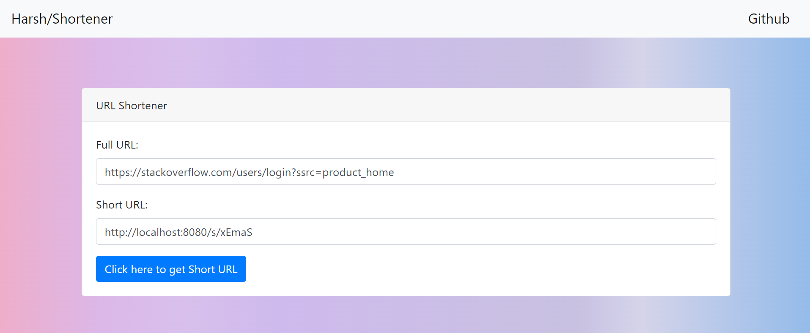

# Url_Shortner
  
 
 
Depenedencies Url = "https://start.spring.io/"
 
Step 1 : Add the following Gradle dependencies to create a project. 
       1. Spring Boot Starter Web 
       2. Spring Boot Starter Thymeleaf 

Step 2 : Create a  Spring Boot application class file.

Step 3: Create a Controller Request Mapping that redirects to index.html

Step 4 : Create the html file .

Step 5: add main.js file for button click event and send the Full URL to RestController(/shortenurl) by using jQuery AJAX.

Step 6: Created a private method to generate a random chars  (Example = http://localhost:8080/s/VRZQe)

Step 7: Created a Model to set and get the FULL URL and SHORT URL.

Step 8: Created a Rest Controller and write a /shortenurl REST API to create a short URL b using Random chars.

Step 9: Write a setShortURL() method to create a short URL by using random chars and putting shortURL in the HashMap.

Step 10: Write a Redirect Controller REST API to redirect the request to FULLURL by using short URL from the HashMap.

